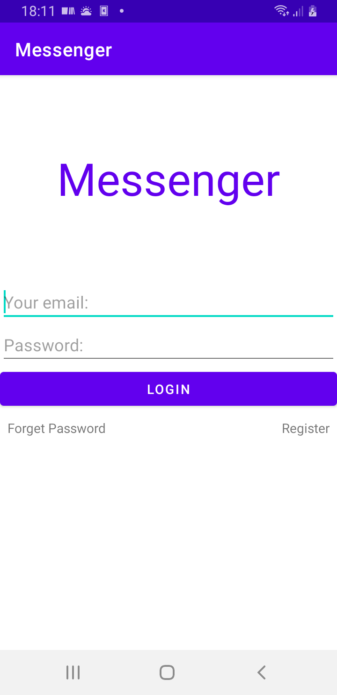
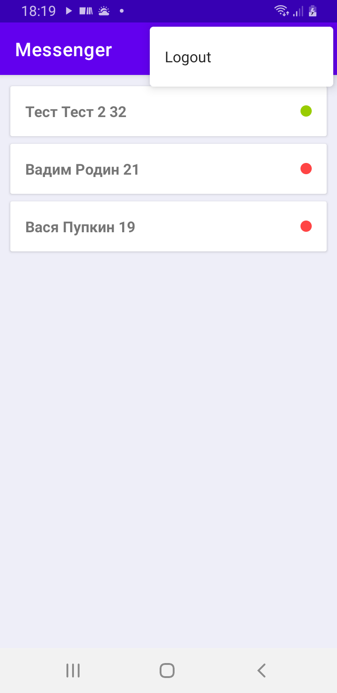
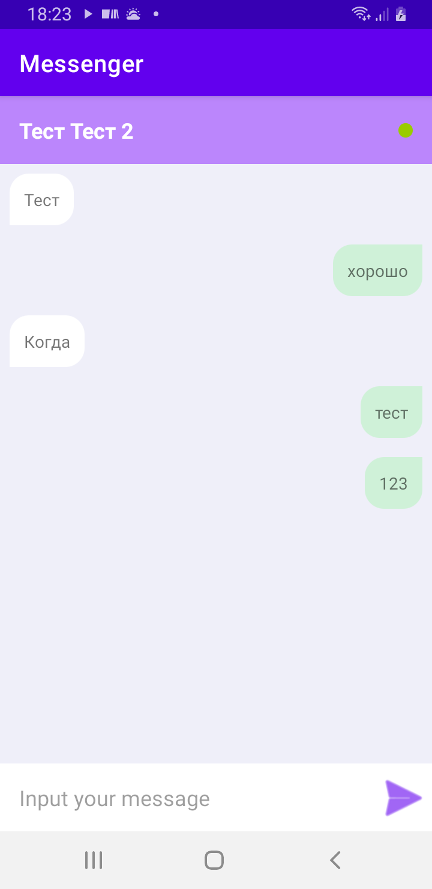

# Messenger-Firebase

Приложение, которое представляет из себя мессенджером. Backend`ом является **Firebase**.
Повод создания его: изучение Firebase Database, Firebase Authentication

## Основной функционал
Отображает онлайн/офлайн пользователя, сброс пароля и возможность создать новый аккаунт, возможность написать пользователю, сообщения видны у обеих по-разному, выйти из аккаунта.

|Вход Messenger-Firebase|Пользователи|Личные сообщения|
|-|-|-|
||||
